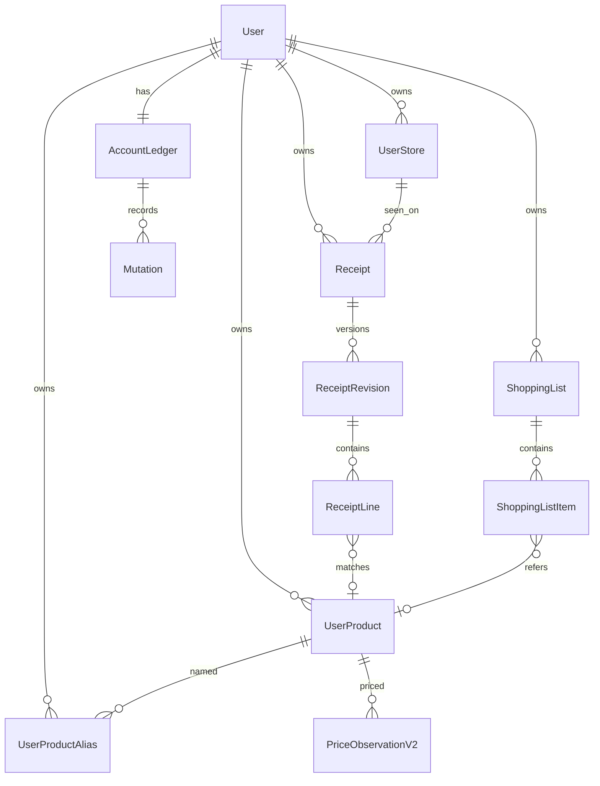

# Datamodell P0

`user_id` utledes alltid fra autentisering. Alle private ID-er er UUID. Oppslag mot annen eiers ID returnerer 404, også for referanser i request body.

## Kjerneentiteter

| Entitet | Nøkkelregler |
|---|---|
| `UserProduct` | visningsnavn, valgfritt merke/variant, pakningsmengde/enhet, pakningsantall, `identity_status` (`confirmed` / `unresolved` / `inherited`), `version` |
| `UserProductAlias` | normalisert tekst, valgfri butikk-/kjedekontekst, kilde, matchmetode. Privat kobling er fasit |
| `UserStore` | kjede, filialnavn, valgfri adresse, `identity_level` (`branch` / `chain_only` / `unknown`) |
| `Receipt` | eier, bilde, status, `uploaded_at`. Kjøpsdato bor på gjeldende revisjon |
| `ReceiptRevision` | monoton revisjon, `confirmed_at`, avstemming. Bare gjeldende bekreftet revisjon publiserer priser |
| `ReceiptLine` | stabil linje-ID, rekkefølge, `line_type`, `net_line_total`, `printed_unit_price`, `quantity_unit`, `price_basis`, `condition` |
| `PriceObservationV2` | peker til linje + revisjon + brukerprodukt + butikk. Ukjent dato/enhet/identitet/rabatt gir ikke rangerbar observasjon |
| `ShoppingList` / `ShoppingListItem` | `active`/`archived`, fritekst eller `user_product_id`, slettemarkør, `version` |
| `AccountLedger` | monoton `price_data_version`. Retting, sletting og merge øker den transaksjonelt |
| `Mutation` | klient `mutation_id` + operasjon + payload-hash. Samme nøkkel/samme payload = samme resultat. Annet innhold = 409 |

## Butikkkvalifisering

- `branch` kan inngå i butikkminimum, antall sammenlignbare butikker og butikkestimat.
- `chain_only` og `unknown` vises som historiske kjøp, men får ikke vinnermerking og telles ikke som sammenlignbare filialer.
- Kjent og ukjent filial i samme kjede er aldri to dokumenterte butikker.

## Handleliste

Maks 200 aktive linjer. Fritekst slås ikke automatisk sammen med kjent produkt. Avkryssing oppretter aldri prisobservasjon.
